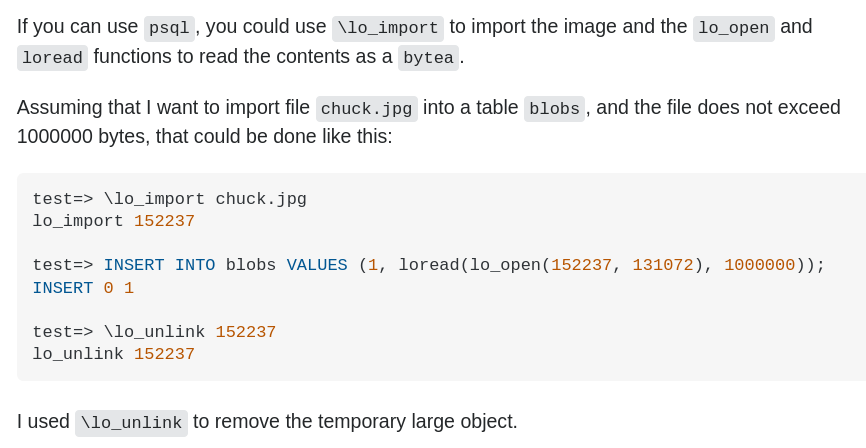

# Pràctica 8: Guardar passwords i imatges a PostgreSQL

La pràctica consisteix en esbrinar com s'han de guardar les claus d'accés dels usuaris en una base de dades. També es veurà com guardar informació en binari de mida gran, com imatges o documents PDF.

## 1. Extensions de PostgreSQL

Contesta a les preguntes següents, fent servir les teves pròpies paraules i citant les fonts consultades:

  a) Què són les extensions de PostgreSQL? Quin avantatge o avantatges té que PostgreSQL suporti extensions?

  b) Com s'afegeix una extensió de PostgreSQL? Com es treu?
  
  c) Busca per a que serveixen les extensions següents:

    postgis
    hstore
    pgcrypto

## 2. Com guardar passwords

Llegeix l'article següent i contesta a les preguntes que tens a continuació:

https://x-team.com/blog/storing-secure-passwords-with-postgresql/

a) Què vol dir l'expresió "en text pla"? Per quines raons no s'han de guardar els passwords "en text pla"?

b) Quines propietats ha de tenir una funció cripotgràfica de hash? Quines funcions de hash suporta pgcrypto? Per quina raó els passwords s'han de guardar fent servir una funció de hash?

c) Què és el "salt"? Per quina raó es fa servir un "salt" quan es guarda el hash d'un password?

## 3. Creació taula users

Crea un usuari i una base de dades per aquesta pràctica que s'anomenin amb el teu nom i el número de pràctica. Per exemple, es podria anomenar `cronaldo_p8`. Consula l'enllaç següent per recordar com fer-ho:

https://medium.com/coding-blocks/creating-user-database-and-adding-access-on-postgresql-8bfcd2f4a91e

A aquesta base de dades, fes els pasos indicats a l'article anterior i crea la taula `users`. Afegeix un usuari amb el teu email de l'institut i el password que vulguis. Comprova amb un select com s'ha emmagatzemat la informació.

## 4. Flask

Per fer-ho més interessant, anem a crear una aplicació web amb python 3 que es connecti a la nostra base de dades.

La pràctica està pensada per a que tinguis la part *python* a la teva màquina real i et connectis al PostgreSQL que tens a una màquina virtual.

***ATENCIÓ! Les intruccions d'instal·lació estan fetes per Linux. Amb una màquina Windows són similars o iguals, però pot haver-hi alguna petita diferència***

a) Assegurat que tens pip3 instal·lat i si no és el cas, instal·la'l. Un cop el tens, explica que és PIP i per que serveix.

b) Instal·la `Flask` anb la comanda següent:

    pip3 install Flask

No cal ser `root` per fer-ho, amb un usuari sense privilegis funcionarà. Ara, busca que és Flask.

c) Executa l'exemple `hello.py` amb la comanda `python3 hello.py` Un cop executat, obriu un navegador a l'adreça http://127.0.0.1:5000/ i podràs veure la teva web. Per aturar el servidor web, fes CTRL+C a la consola on has executat l'script python.

Desprès, personalitza el missatge per a que surti el teu nom i fes una captura de pantalla.

## 5. Python i PostgreSQL

a) Instal·la `psycopg2` amb pip.

    pip3 install psycopg2-binary

Un cop instal·lat, busca informació sobre que és psycopg2.

b) Executa l'exemple `db_test.py` canviant les dades de connexió per les de la teva base de dades. Mostra una captura de pantalla mostrant el resultat. Prova d'afegir un altre usuari a la base de dades i comprova que refrescant la web, surt aquest segon usuari.

c) Modifica l'aplicació per a que mostri també l'identificador de l'usuari (la columna `id` de la taula `users`)

## 6. Login amb la taula users

Per a poder fer el sistema d'autenticació fent servir la taula `users`, cal instal·lar la llibreria `flask-login`, que simplifica l'implementació del login/logout:

    pip3 install flask-login

a) Executa l'exemple `autenticacio.py` canviant les dades de connexió per les de la teva base de dades. Mostra una captura de pantalla mostrant el resultat.

b) Modifica l'exemple `autenticacio.py` afegint HTML i CSS al codi HTML bàsic que té.

## 7. Una nova taula

Crea una nova taula anomenada `productes` on es guardaran el productes de la llista de la compra dels usuaris:

    CREATE TABLE productes(
        id serial PRIMARY KEY,
        user_id int REFERENCES users(id),
        name TEXT,
        euros INT
    );

Insereix un parell de productes associats al teu usuari i fes que es mostrin a la web de l'apartat anterior allà on diu *AQUÍ HAURIA DE MOSTRAR LA LLISTA DE LA COMPRA DEL USUARI AMD ID...*

## 8. Dades binàries a PostgreSQL

A l'enllaç següent trobaràs informació de com guardar dades binàries a PostgreSQL: https://wiki.postgresql.org/wiki/BinaryFilesInDB

Quines opcions hi ha i quins avantatges i desavantatges té cada opció?

## 9. Tipus de dades bytea

Modifica la taula `productes` i crea una nova columna no nulla que sigui del tipus `bytea`.

A continuació, afegeix imatges en format PNG als productes que has inserit en l'apartat anterior.

Per fer els inserts des de psql, consulta l'exemple de Stackoverflow: https://stackoverflow.com/a/51387399

En aquest exemple es veu com primer heu d'importar la imatge fent servir la comanda `\lo_import` i llavors aquesta imatge queda guardat com a una taula interna com de `large objects` amb identificador 152237. Desprès, es fa un insert llegint el `large object`. Quan es llegeix amb la funció `loread`, hi ha el valor 1.000.000 que es per fixar una mida màxima de bytes, i amb la funció `lo_open` hi el valor [131072](https://dba.stackexchange.com/a/189718) que és tan sols un flag per indicar que llegeix el `large_object` com una seqüencia de números.

## 10. Imatges a la nostra web

Modifica l'aplicació web per a que quan es mostrin els productes, es mostrin també les imatges PNG guardades a la base de dades.

Per fer-ho, fes un query com la d'aquest exemple (canviant gif per png): https://stackoverflow.com/a/48942306

I mira aquest altre exemple per veure com visualitzar una imatge en format base64 amb HTML: https://stackoverflow.com/a/8499716

## 11. [OPCIONAL] Templates amb Flask

Apartat opcional i que no res a veure amb bases de dades, però escriure HTML directament al cody python no és una pràctica recomanable. El que es fa servir són *templates*: https://flask.palletsprojects.com/en/1.1.x/quickstart/#rendering-templates

Modifica la teva aplicació web per a que faci servir templates i no hi hagi gens de code HTML al fitxer python.
